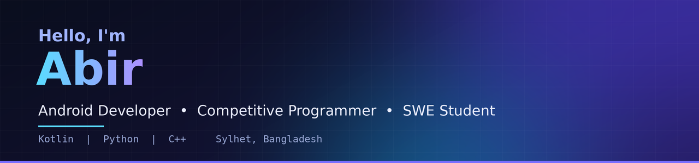

  

<h1 align="center">Hello, I'm Abir</h1>

  <strong>Full Stack Developer</strong> •<strong>Android Developer</strong> • <strong>Competitive Programmer</strong> • <strong>SWE Student</strong>

  
  

## About Me

I’m Abir, a software engineering student with a passion for Android development, problem solving, and building meaningful digital experiences. I enjoy turning ideas into polished products, exploring modern technologies, and continuously improving my skills through real-world projects and coding challenges.

## Current Work / Activities

- I’m exploring Next.js and modern full-stack development.
- I’m building Android apps and learning how to design smooth, scalable user experiences.
- I enjoy solving competitive programming problems and strengthening algorithmic thinking.

## Skills

  

## GitHub Stats

  
  

## Tech Stack

  
  
  
  
  
  

  <i>Always learning, building, and growing one project at a time.</i>

